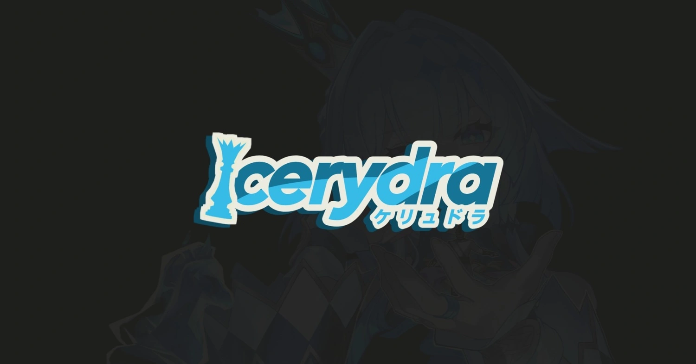

<div align="center">
  
  <h1>Cerydra Anime Streaming</h1>
  <p><strong>A beautifully designed, premium anime streaming application built with Astro 6, React 19, and Material UI 3.</strong></p>
  
  [](https://astro.build/)
  [](https://react.dev/)
  [](https://www.typescriptlang.org/)
  [](https://vercel.com/)
</div>

<hr />

## Features

- **Premium UI/UX:** Stunning Material Design 3 interface with dark mode, fluid animations, and a polished aesthetic.
- **Global Player (PiP):** Watch anime continuously. The video player persists as a mini-player (Picture-in-Picture) across pages while you browse, thanks to Astro View Transitions.
- **Hybrid Search Engine:** Blends exact-match indexing with rich metadata (AniList) for incredibly accurate and visually rich search results (supporting Romaji and Kanji).
- **Watch History and Bookmarks:** Seamlessly syncs your watch history and current episode progress using Turso (Edge SQLite) via Discord OAuth.
- **Smart Source Extraction:** Automatically bypasses provider blocks, extracting raw `.m3u8` and `.mp4` streams for a native ad-free playback experience.
- **Ultra Fast SSR:** Powered by Astro Server-Side Rendering and Cloudflare R2 caching for lightning-fast page loads.

## Architecture and Tech Stack

- **Framework:** Astro 6 (SSR) with React 19 Islands
- **Styling:** Material UI 9 (Emotion) and Tailwind CSS v3
- **Video Player:** Custom Vidstack React v1 (MD3 styling, Wave seekbar, Double-tap seeking)
- **Data Fetching:** TanStack React Query (Client), Custom server cache
- **Database:** Turso (libsql) with local SQLite fallback
- **Auth:** Discord OAuth (via Arctic)
- **Video Delivery:** Cloudflare Worker Proxy (CORS bypass and Edge Caching)

## Getting Started

### 1. Prerequisites
Make sure you have Node.js and `pnpm` installed on your machine.

### 2. Installation
```bash
git clone https://github.com/Wingky530/cerydra-public.git
cd cerydra-public
pnpm install
```

### 3. Environment Variables
Rename `.env.example` to `.env` and fill in the necessary API keys and variables:
```bash
cp .env.example .env
```
Note: For the application to stream videos properly, you will need to setup a Cloudflare Worker and input the URL in `PUBLIC_VIDEO_PROXY_URL`.

### 4. Database Setup
Run the migration script to initialize the local SQLite database (`local.db`):
```bash
pnpm migrate
```

### 5. Start Development Server
```bash
pnpm dev
```
Open [http://localhost:4321](http://localhost:4321) in your browser.

## Project Structure

```
src/
├── components/        # React UI components (Md3VideoPlayer, AppShell, WatchContent)
├── hooks/             # Custom React hooks
├── lib/               # Core utilities, API clients, and Scraper scripts
├── pages/             # Astro routing (SSR pages) and API routes (/api/)
├── pages-react/       # Client-side hydrated React pages
├── styles/            # Global CSS and Tailwind directives
└── theme/             # MUI theme configuration
```

## Disclaimer and License

This project is created for educational and experimental purposes only. Cerydra does not host any video files on its own servers. All content is scraped and proxy-streamed from third-party sources.

Released under the **MIT License**.
